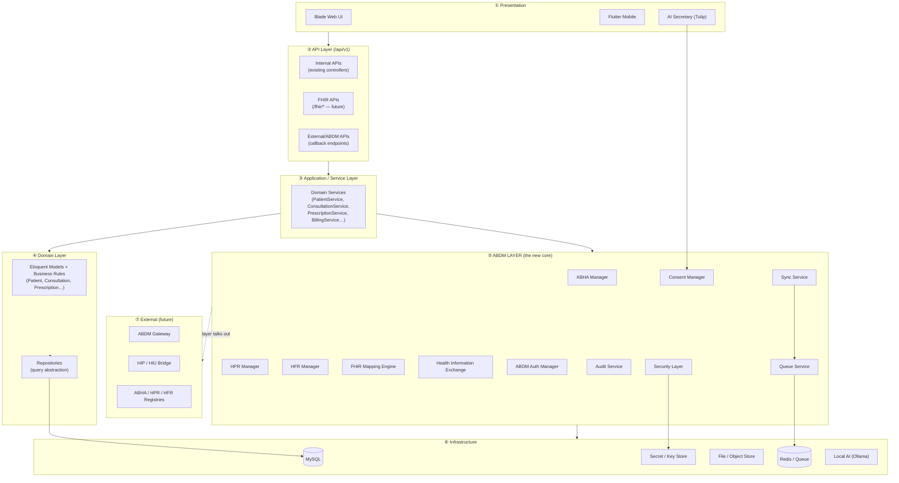
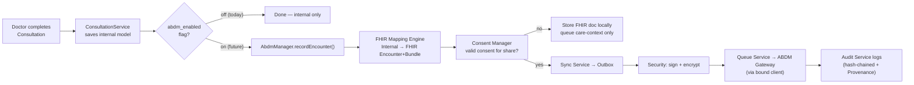
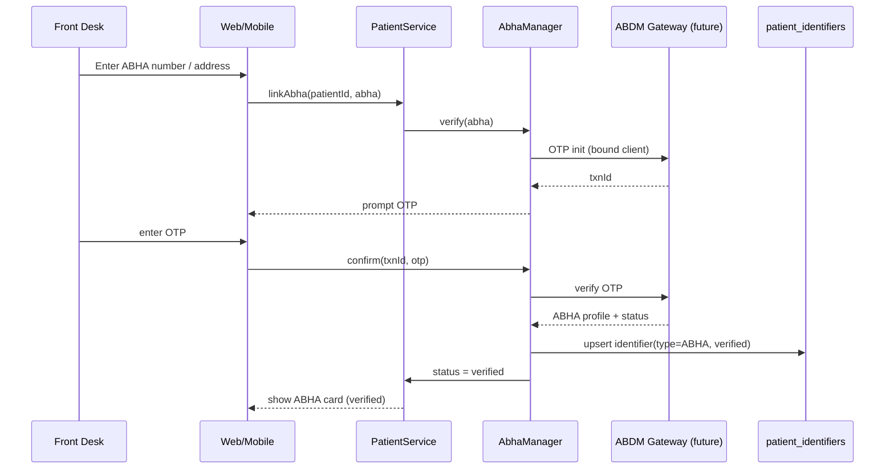
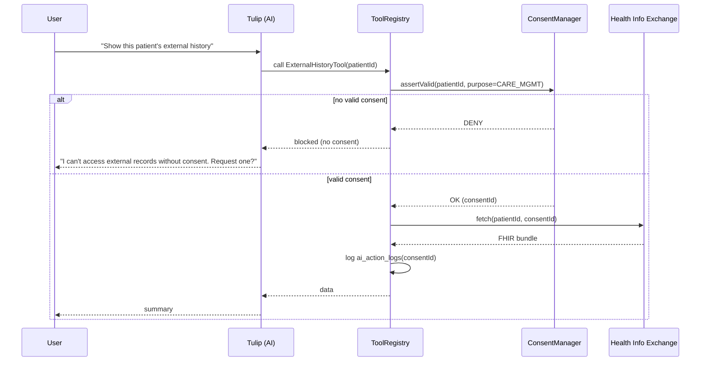
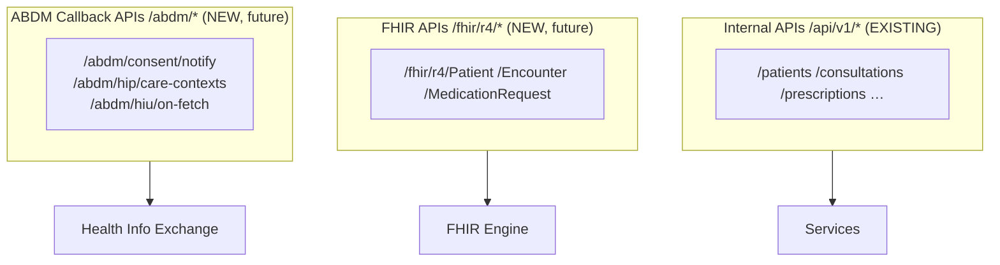
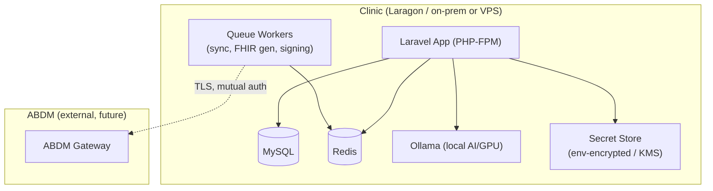

# 02 · Target Architecture
### The ABDM-native layered design for Dentfluence OS

**Status:** DESIGN ONLY. Mermaid diagrams render in VS Code / GitHub / any Mermaid viewer.
**Premise from doc 00:** ABDM is a *core layer*. Modules never call ABDM APIs directly — they call the **ABDM Layer**, which owns identity, consent, FHIR, exchange, sync and security.

---

## 1. The big picture — layered architecture



**The single most important arrow:** only the ABDM Layer (⑤) crosses into External (⑦). No controller, service, or model ever imports an ABDM SDK. This is the rule that makes future API changes a one-layer edit.

---

## 2. Folder structure (proposed, additive)

The existing `app/` is untouched; we add an `app/Abdm/` namespace and small seams.

```
app/
├── Http/Controllers/            # EXISTING — unchanged
│   └── Api/V1/                  # EXISTING internal APIs
│       └── Fhir/                # NEW (future) FHIR endpoints
├── Models/                      # EXISTING + new identity/consent models
│   ├── Identity/                # NEW  PatientIdentifier, PractitionerIdentifier…
│   ├── Consent/                 # NEW  Consent, ConsentArtefact, ConsentAudit
│   └── Fhir/                    # NEW  FhirDocument, TerminologyMap
├── Services/                    # EXISTING domain services — unchanged
│
└── Abdm/                        # ★ NEW — the ABDM Layer (single entry point)
    ├── AbdmManager.php          # facade other code calls
    ├── Identity/
    │   ├── AbhaManager.php
    │   ├── HprManager.php
    │   └── HfrManager.php
    ├── Consent/
    │   ├── ConsentManager.php
    │   └── ConsentPolicy.php
    ├── Fhir/
    │   ├── FhirMappingEngine.php
    │   ├── Mappers/             # PatientMapper, EncounterMapper, …
    │   ├── Bundles/             # OPConsultationBundle, PrescriptionBundle…
    │   └── Terminology/         # ConceptMap resolver
    ├── Exchange/
    │   ├── HealthInformationExchange.php   # HIP + HIU behaviour
    │   └── CareContextLinker.php
    ├── Auth/
    │   └── AbdmAuthManager.php   # OAuth2 gateway tokens (isolated)
    ├── Sync/
    │   ├── SyncService.php
    │   ├── Outbox.php / Inbox.php / RetryQueue.php
    │   └── ConflictResolver.php
    ├── Security/
    │   ├── EncryptionService.php
    │   ├── SignatureService.php
    │   └── TokenRotator.php
    ├── Audit/
    │   └── AbdmAuditService.php  # hash-chained
    ├── Contracts/               # interfaces (so impl can swap: sandbox/prod/mock)
    │   ├── AbdmGatewayClient.php
    │   └── RegistryClient.php
    └── Clients/
        ├── NullGatewayClient.php # DEFAULT this phase — does nothing
        ├── SandboxGatewayClient.php   # future
        └── ProductionGatewayClient.php# future
```

**Why `Contracts/` + `Clients/`:** the ABDM Layer codes against *interfaces*. Today the bound implementation is `NullGatewayClient` (no-op, feature-flag off). Later we bind Sandbox, then Production — **zero changes** to any module or service. This is the migration's core future-proofing.

---

## 3. The golden path — how a module emits a record (data-flow)



The module (`ConsultationService`) does **one** new thing: call `AbdmManager.recordEncounter($consultation)`. Everything else is internal to the layer and flag-gated. Today the flag is off → the call is skipped entirely.

---

## 4. Sequence — ABHA verification & linking (future, but designed now)



This phase we build the `AbhaManager` interface + `patient_identifiers` table + UI card; the `GW` calls resolve to `NullGatewayClient` until Sandbox arrives.

---

## 5. Sequence — Consent-gated AI access (the safety-critical path)



The AI literally cannot reach external data except through a tool that calls `ConsentManager::assertValid()` first. Default: `ExternalHistoryTool` is disabled by flag.

---

## 6. Layer responsibilities (contract table)

| Layer | Owns | Must NOT do |
|---|---|---|
| Presentation | UI, capture, display | business logic, FHIR |
| API | routing, auth, validation, envelope | clinical rules |
| Service | orchestration, transactions, domain workflow | hand-write FHIR, call ABDM |
| Domain | entities, invariants, relationships | know ABDM exists |
| **ABDM Layer** | identity, consent, FHIR, exchange, sync, security, ABDM audit | leak clinical logic back up |
| Infrastructure | persistence, queue, store, keys | business decisions |

**Dependency rule:** dependencies point *downward and inward*. Domain never depends on ABDM Layer; **Service** depends on ABDM Layer (the seam). This keeps the domain pure and testable.

---

## 7. API architecture — three clear surfaces



- **Internal APIs** — unchanged; your app and Flutter keep working exactly as today.
- **FHIR APIs** — read-only FHIR projection of internal data (future; for PHR/HIU).
- **ABDM Callback APIs** — endpoints the ABDM Gateway calls back into (consent notifications, data requests). Secured separately (doc 07). Built later; the *routes are reserved* now.

---

## 8. Repository layer (light introduction)

Today services query Eloquent directly — fine. For ABDM we introduce **thin repositories only where the ABDM Layer needs to read across modules** (e.g. assembling a full patient health record bundle), so the layer doesn't reach into 10 models. Existing services are not forced to adopt repositories — this is additive and optional.

---

## 9. Deployment architecture



**Key deployment decisions:**
- **Queue workers are mandatory** for ABDM (sync/signing must be async). Today the app runs largely synchronously; Phase 1 introduces a worker (`php artisan queue:work`) — additive.
- **Secrets never in DB or code** — only references in DB; actual keys in an encrypted secret store / KMS (doc 07).
- **AI stays local** (Ollama) — patient data never leaves for inference, which is itself a consent/privacy win.
- ABDM egress is **only from workers**, over TLS with mutual auth — a single, auditable choke point.

---

## 10. Scalability strategy (15-year horizon)

| Concern | Strategy |
|---|---|
| Multi-clinic / multi-facility | `branch_id` already pervasive; promote to first-class tenant scope; per-branch HFR/HIP config (`facility_abdm_config`). |
| Document volume | FHIR docs stored as references + object store, not BLOBs in MySQL; hash-chained audit in append-only tables. |
| Sync throughput | Queue-backed outbox/inbox with backpressure; retprovider rate-limit aware; batchable. |
| Terminology growth | Data-driven `terminology_maps` (ConceptMap) — add codes without deploys. |
| Registry/API churn | `Contracts/`+`Clients/` — swap implementations, not callers. |
| Read scale | Repositories + read models for heavy bundle assembly; cache verified identifiers. |
| Offline clinics | Sync Engine offline mode + conflict resolver (doc 06); app fully usable without ABDM. |
| Schema evolution | Additive-only + identifier normalization removes the "add a column per identity" churn forever. |

---

## 11. What is genuinely new vs. reused

**Reused (Dentfluence already has, big head-start):**
- Audit foundation (`audit_logs`, `Auditable`, `ai_action_logs`) → extend for ABDM.
- Tool-gated AI with confirm-cards → perfect consent-gate host.
- ICD-10 on consultations, coded `rx_drugs`, CDSS → FHIR-ready clinical data.
- Append-only ledgers (stock/wallet) → the pattern for sync outbox + consent audit.
- Sanctum API + envelope + RBAC → host for FHIR/ABDM endpoints.
- Versioned prescriptions, soft deletes → provenance-friendly.

**Genuinely new (this migration builds):**
- ABDM Layer (`app/Abdm/`) + `Contracts/Clients` binding.
- Identifier normalization (`patient_identifiers`, etc.).
- FHIR Mapping Engine + `fhir_documents` + `terminology_maps`.
- Consent Engine (`consents`/`consent_artefacts`/`consent_audit`).
- Sync Engine (`sync_*` queues) + queue workers.
- Security Layer (signing, encryption-at-rest for identifiers, ABDM token rotation).
- Per-facility ABDM settings + feature flags.

> Next: `03-DATA-MODEL-AND-SCHEMA.md` specifies every new table and column precisely; `04`–`07` detail the engines; `08` sequences the build.
