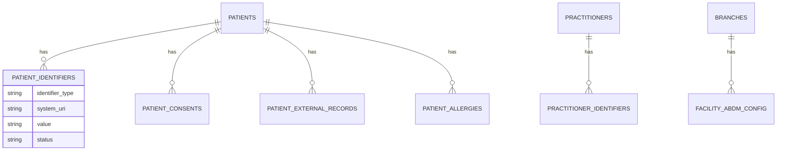
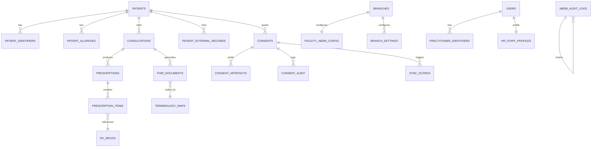

# 03 · Data Model & Schema
### Identifier normalization, new tables, additive columns, ER additions

**Status:** DESIGN ONLY — no migrations written or run. This is the agreed schema contract.
**Rules:** Additive-only. Every new column is `nullable`. No existing column is dropped or repurposed. Old columns (`patient_id`, `license_number`, `branches.code`) keep working and are *mirrored* into the new identifier tables (dual-write).

---

## 1. The core idea — identity is a bundle, not a column

Today: `patients.patient_id` (one string). Problem: ABDM adds ABHA number, ABHA address, government ID, insurance ID, FHIR logical id… and more will come. Adding a column per identity type means a migration every time and brittle queries.

Solution: a **polymorphic identifier table**. A patient (or doctor, or clinic) *has many identifiers*, each typed. This is also exactly how FHIR models identity (`identifier[]` with a `system` + `value`).

---

## 2. New table — `patient_identifiers`  (🔴 core)

One row per identifier a patient holds. Maps 1:1 to FHIR `Patient.identifier[]`.

| Column | Type | Notes |
|---|---|---|
| id | bigint PK | |
| patient_id | FK → patients | indexed |
| identifier_type | enum | `internal` · `abha_number` · `abha_address` · `aadhaar_ref` · `pan` · `driving_license` · `passport` · `insurance` · `fhir_logical` · `mrn_external` |
| system_uri | string | FHIR identifier system, e.g. `https://healthid.ndhm.gov.in` |
| value | string (encrypted for gov IDs) | the actual identifier |
| value_last4 | string(4) | searchable tail for gov IDs (full value encrypted) |
| status | enum | `active` · `pending` · `verified` · `revoked` · `failed` |
| is_primary | boolean | one primary per type |
| verified_at | datetime nullable | |
| source | enum | `manual` · `abdm` · `import` |
| meta | json nullable | extra (e.g. ABHA profile snapshot) |
| timestamps + soft deletes | | |

**Indexes:** `(patient_id, identifier_type)`, `(identifier_type, value_last4)`, unique `(identifier_type, value)` where type∈(abha_number, abha_address).

**Dual-write:** on patient create, also insert `{type: internal, value: patients.patient_id}`. The old column stays authoritative for internal use.

---

## 3. Additive columns — `patients`  (🔴)

All nullable, all additive (quick-lookup mirrors of the most-used identifiers + FHIR/ABDM state):

| Column | Type | Purpose |
|---|---|---|
| abha_number | string(17) nullable | 14-digit (stored with hyphens), mirror of identifier row for fast display |
| abha_address | string nullable | e.g. `name@sbx` |
| abha_verification_status | enum nullable | `unlinked`(default) · `pending` · `verified` · `failed` · `revoked` |
| abha_linked_at | datetime nullable | |
| preferred_language | string(8) nullable | ISO 639 (`en`,`hi`,`mr`) — drives FHIR `communication` + Rx language |
| fhir_resource_id | uuid nullable | stable FHIR logical id |
| gov_id_type | string nullable | reference only |
| gov_id_last4 | string(4) nullable | never store full Aadhaar; full value (if ever) lives encrypted in `patient_identifiers` |
| abdm_care_contexts_count | int default 0 | denormalized count of linked visits |

> Note: `gender` already supports `other`; FHIR `administrative-gender` adds `unknown` — handle via mapper, no column change.

---

## 4. New table — `practitioner_identifiers` + columns on `hr_staff_profiles`  (🔴)

`practitioner_identifiers` mirrors the patient pattern (types: `internal` · `hpr_id` · `council_reg` · `fhir_logical`).

Additive columns on `hr_staff_profiles` (nullable):

| Column | Type | Purpose |
|---|---|---|
| hpr_id | string nullable | Healthcare Professional Registry id |
| hpr_verification_status | enum nullable | `unlinked`·`pending`·`verified`·`failed` |
| hpr_linked_at | datetime nullable | |
| medical_council_name | string nullable | e.g. "Maharashtra State Dental Council" |
| registration_year | year nullable | |
| digital_signature_ref | string nullable | pointer to key in secret store — **never the key itself** |
| fhir_practitioner_id | uuid nullable | |

New table `practitioner_qualifications` (maps to `Practitioner.qualification[]`): `id, user_id FK, degree, institution, year, registration_number, council_name`. Existing single `qualification`/`license_number` columns kept and mirrored.

---

## 5. New tables — facility / clinic  (🔴)

**First: create the `Branch` Eloquent model** (migration exists, model does not). Then:

Additive columns on `branches` (nullable): `hfr_id`, `facility_verification_status` (enum), `facility_type` (enum: clinic/hospital/diagnostic_centre/dental_clinic), `organization_mapping_id`, `geo_lat` decimal(10,7), `geo_lng` decimal(10,7), `fhir_organization_id` uuid, `fhir_location_id` uuid, `digital_certificate_ref`.

**New table `facility_abdm_config`** (per-branch — credentials are placeholders/references this phase):

| Column | Type | Notes |
|---|---|---|
| id | bigint PK | |
| branch_id | FK → branches unique | |
| environment | enum | `sandbox`(default) · `production` |
| hip_id | string nullable | Health Information Provider id |
| hiu_id | string nullable | Health Information User id |
| hfr_id | string nullable | mirror |
| gateway_base_url | string nullable | |
| client_id_ref | string nullable | **secret-store reference**, not value |
| client_secret_ref | string nullable | **secret-store reference**, not value |
| signing_key_ref | string nullable | reference |
| consent_default_expiry_days | int default 180 | |
| is_enabled | boolean default false | per-facility kill switch |
| timestamps | | |

---

## 6. New table — settings per facility  (🔴)

Today `app_settings` is global key-value. We add **`branch_settings`** (preferred — keeps `app_settings` untouched) with the same KV+group shape plus `branch_id`:

`id, branch_id FK, group, key, value (json/text), updated_by, timestamps` — unique `(branch_id, group, key)`.

New setting **groups** (all default off / safe): `abdm`, `fhir`, `consent`, `data_exchange`, `security`, `api_endpoints`, `audit`, `sync`, `feature_flags`. Key feature flags (global, in `app_settings`): `abdm_enabled=0`, `fhir_enabled=0`, `consent_required=1`, `abha_linking_enabled=0`, plus per-module rollout flags.

---

## 7. New tables — Consent Engine (detailed in doc 05)

| Table | Purpose |
|---|---|
| `consents` | one consent *request/grant* per patient+purpose+requester |
| `consent_artefacts` | the signed artefact(s) ABDM returns (granular: which records, what window) |
| `consent_audit` | immutable, hash-chained log of every consent state change |
| `patient_external_records` | index of records linked/fetched from HIE under a consent |

Core `consents` columns: `id, patient_id FK, purpose (enum), requester_type/id, provider_facility, status (requested/granted/denied/revoked/expired), scope (json: hi_types, date_range), granted_at, expires_at, revoked_at, abdm_consent_id, created_by, timestamps`.

---

## 8. New tables — FHIR layer (detailed in doc 04)

| Table | Purpose |
|---|---|
| `fhir_documents` | every generated FHIR resource/Bundle: `id, owner_type, owner_id (polymorphic), resource_type, fhir_id (uuid), version, status (draft/final/amended), bundle_type, content_ref (object-store path), content_hash, signed (bool), signature_ref, generated_by, timestamps` |
| `terminology_maps` | ConceptMap: `id, domain (condition/procedure/observation/drug/tooth), local_code/local_term, standard_system (SNOMED/LOINC/ICD10/ATC/FDI), standard_code, standard_display, is_active` |

---

## 9. New tables — Sync Engine (detailed in doc 06)

| Table | Purpose |
|---|---|
| `sync_outbox` | outgoing items to ABDM: `id, entity_type, entity_id, operation, payload_ref, status (queued/sending/sent/failed), attempts, next_attempt_at, last_error, abdm_txn_id, timestamps` |
| `sync_inbox` | incoming items (data pushed/fetched from HIE) awaiting processing |
| `sync_failed` | dead-letter after max retries (manual review) |
| `sync_versions` | version vector per entity for conflict resolution |

---

## 10. New / changed tables — clinical mapping anchors

These are **additive nullable columns** on existing clinical tables, purely to hold the FHIR logical id (so we can round-trip without re-deriving):

| Table | Added columns |
|---|---|
| consultations | `encounter_status`, `encounter_class`, `care_context_reference`, `fhir_encounter_id`, `fhir_composition_id` |
| treatment_plans | `fhir_careplan_id` |
| treatment_plan_items | `fhir_procedure_id` (planned) |
| treatment_visits | `fhir_procedure_id`, `fhir_encounter_id` |
| prescription_items | `fhir_medicationrequest_id` |
| rx_drugs | `snomed_code`, `who_atc_code` |
| clinical_media | `fhir_imagingstudy_id`, `fhir_diagnosticreport_id`, `modality_code`, `dicom_uid` |
| lab_cases | `fhir_servicerequest_id`, `fhir_diagnosticreport_id` |
| appointments | `fhir_appointment_id`, `published_to_abdm` |
| invoices | `fhir_invoice_id` (optional) |
| clinical_files / patient_documents | `fhir_documentreference_id`, `document_type_code`, `is_abdm_shareable` |
| inventory_items | `udi`, `gtin` (implants only) |
| ai_action_logs | `consent_id` (provenance for external-data tool calls) |

---

## 11. New first-class table — `patient_allergies`  (🟠)

Promote allergies from a JSON blob on `patients` to a queryable resource (maps to FHIR `AllergyIntolerance`, feeds CDSS *and* exchange). Keep `patients.allergies` JSON mirrored (non-breaking).

| Column | Type | Notes |
|---|---|---|
| id | bigint PK | |
| patient_id | FK | |
| substance | string | free text or coded |
| snomed_code | string nullable | coding for FHIR |
| category | enum | `medication`·`food`·`environment`·`biologic` |
| criticality | enum | `low`·`high`·`unable-to-assess` |
| reaction | string nullable | |
| recorded_by | FK users nullable | |
| source | enum | `intake`·`clinician`·`abdm_external` |
| timestamps + soft deletes | | |

---

## 12. New table — `abdm_audit_logs`  (🟠, hash-chained)

Dedicated, append-only, tamper-evident audit for all ABDM/consent/HIE actions (separate from generic `audit_logs`).

| Column | Type | Notes |
|---|---|---|
| id | bigint PK | |
| event_type | enum | `consent_requested/granted/revoked/expired` · `record_shared` · `record_fetched` · `abha_linked` · `document_signed` · `gateway_call` |
| actor_type/actor_id | polymorphic | user or system |
| patient_id | FK nullable | |
| consent_id | FK nullable | |
| abdm_txn_id | string nullable | |
| payload_hash | string | SHA-256 of payload |
| prev_hash | string | hash of previous row → chain |
| row_hash | string | SHA-256(this row + prev_hash) |
| created_at | datetime | (no updates — immutable) |

`row_hash` chaining makes any tampering detectable. Maps to FHIR `AuditEvent` + `Provenance`.

---

## 13. Full ER overview (new + key existing)

---

## 14. Migration strategy (when we build — Phase 1)

1. **Wave 1 (identity):** `patient_identifiers`, `practitioner_identifiers`, `practitioner_qualifications`, additive columns on patients/hr_staff_profiles/branches; `Branch` model. Backfill internal identifiers from existing columns.
2. **Wave 2 (config):** `facility_abdm_config`, `branch_settings`, feature flags seeded **off**.
3. **Wave 3 (FHIR):** `fhir_documents`, `terminology_maps`, the `fhir_*_id` nullable columns; seed terminology maps for the codes you already use (ICD-10, FDI).
4. **Wave 4 (consent/sync/audit):** `consents`, `consent_artefacts`, `consent_audit`, `patient_external_records`, `sync_*`, `abdm_audit_logs`, `patient_allergies` (+ backfill from JSON).

Each wave is independently shippable, reversible (drop new tables), and behind flags. **No `migrate:fresh`, no destructive migration — ever.** (Per your project rule, you run the migrations; I only provide them.)

> Next: `04-FHIR-MAPPING-ENGINE.md` — how internal rows become FHIR resources and ABDM payloads.
