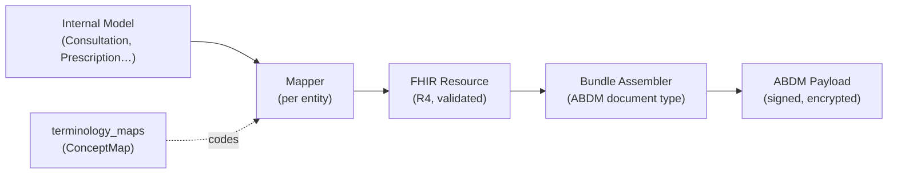

# 04 · FHIR Mapping Engine
### Internal Model → FHIR Resource → ABDM Payload

**Status:** DESIGN ONLY.
**Iron rule:** Business modules **never** hand-write FHIR JSON. They pass their normal Eloquent models to the engine; the engine produces FHIR. One place to fix, one place to certify, one place to evolve.

---

## 1. The three-stage pipeline



1. **Mapper** — converts one internal model → one FHIR resource. Pure, testable, no I/O.
2. **Bundle Assembler** — composes related resources into an ABDM *health-record bundle* (e.g. an OP Consultation record = Composition + Encounter + Condition + Observation + MedicationRequest…).
3. **Payload** — the Security Layer signs + encrypts the bundle for transport (doc 07).

---

## 2. Engine shape (code-level contract)

```php
// app/Abdm/Fhir/FhirMappingEngine.php  (illustrative — NOT built this phase)
interface Mapper {
    public function toFhir(Model $model): array;   // returns FHIR resource as array
}

final class FhirMappingEngine {
    public function map(Model $m): array;                 // dispatch to right mapper
    public function bundle(string $type, array $models): array; // assemble bundle
    public function persist(array $fhir, Model $owner): FhirDocument; // store + version + hash
}
```

- One mapper class per entity in `app/Abdm/Fhir/Mappers/`.
- One assembler per ABDM doc type in `app/Abdm/Fhir/Bundles/`.
- The engine is the **only** caller of mappers; services call only `AbdmManager`, which calls the engine.

**Why interfaces:** mappers can be unit-tested against the official FHIR R4 examples and ABDM profiles without a database or network.

---

## 3. Terminology is data, not code

Every coded field resolves through `terminology_maps` (the `ConceptMap` table from doc 03). Example rows:

| domain | local_term | standard_system | standard_code | standard_display |
|---|---|---|---|---|
| tooth | `26` (FDI) | `urn:iso:std:iso:3950` | 26 | Upper left first molar |
| procedure | `RCT` | SNOMED CT | 234789004 | Root canal therapy |
| observation | `BP` | LOINC | 85354-9 | Blood pressure panel |
| condition | `K02.9` | ICD-10 | K02.9 | Dental caries, unspecified |
| drug | `Amoxicillin 500` | WHO-ATC | J01CA04 | Amoxicillin |

A mapper calls `Terminology::resolve('procedure', 'RCT')` → `{system, code, display}`. Add a new code by inserting a row — no deploy. This is the single most important 15-year decision in the mapping layer.

---

## 4. Per-entity mapping contracts

For each, the engine's mapper turns the **real columns** (verified in doc 01) into the FHIR resource.

### 4.1 Patient → `Patient`
- `patient_identifiers[]` → `identifier[]` (each with its `system_uri`); ABHA number/address get NDHM systems.
- `first/middle/last/title` → `name[]` (HumanName); `gender` → `administrative-gender` (map `other`→other, missing→unknown).
- `date_of_birth`/`dob_unknown`+`age_years` → `birthDate` (or `Patient.extension[birthTime]` / estimated).
- `phone/alternate_phone/email` → `telecom[]`; address fields → `address[]` (IN, `pincode`→postalCode).
- `preferred_language` → `communication[].language`.
- `emergency_contact_*` → `contact[]`.

### 4.2 Practitioner → `Practitioner` + `PractitionerRole`
- `practitioner_identifiers` (hpr_id, council_reg) → `identifier[]`.
- `name`, `qualification`/`practitioner_qualifications[]` → `qualification[]`.
- role + `branch_id` → `PractitionerRole` (specialty from `specialization`, organization = facility).

### 4.3 Clinic → `Organization` + `Location`
- `hfr_id` → `identifier`; `name`, `facility_type` → type; address → `address`; `geo_lat/lng` → `Location.position`.

### 4.4 Consultation → `Encounter` (+ Care Context)
- `encounter_status` (mapped from `status`) → `Encounter.status`; `encounter_class` → `class` (AMB/EMER).
- `consultation_type`/`visit_type` → `type[]`; `doctor_id` → `participant`; `branch_id` → `serviceProvider`.
- diagnoses (`primary/secondary/provisional`, `diagnosis_icd_code`) → `Encounter.diagnosis[]` + `Condition` resources.
- becomes the **Care Context** linked to ABHA on completion (Sync Engine).

### 4.5 Clinical Findings → `Composition` + `Observation[]`
- each finding field (`soft_tissue`, `caries`, `periodontal`, `bleeding_on_probing`, `plaque_index`, `occlusion`, `tmj`) → an `Observation` (LOINC/SNOMED via terminology_maps).
- `chart_data` (FDI tooth chart) → tooth-level `Observation`s with `bodySite` FDI coding.
- the consultation document spine → `Composition` (type: dental clinical note).

### 4.6 Treatment Plan → `CarePlan` + `Goal` + planned `Procedure` + `Condition`
- plan → `CarePlan` (status from `accepted_at`; intent from `plan_type`).
- `treatment_plan_items[]` → planned `Procedure` (status=preparation) + `Goal`; ordering → `CarePlan.activity`.

### 4.7 Treatment Visit → `Procedure` (+ vitals `Observation`)
- `treatment_name`/`procedure` → SNOMED procedure; `tooth_number` → `bodySite` (FDI).
- specialty fields (RCT canals, implant brand/size…) → `Procedure.note` / extensions.
- vitals (`bp_systolic/diastolic`, `pulse_rate`, `spo2`, `temperature`, `blood_sugar`, `weight`) → vital-sign `Observation`s (LOINC).

### 4.8 Prescription → `MedicationRequest[]` + `Medication` + `AllergyIntolerance`
- each `prescription_item` → `MedicationRequest`; drug → `Medication` (coded via `who_atc_code`/`snomed_code`).
- dosage: `morning/afternoon/night` + `duration`+`duration_unit` + `route` + `food_advice` → `Dosage` + `timing`.
- `prescriptions.status` → FHIR request status; multilingual `patient_instruction_*` → `dosageInstruction.patientInstruction`.
- `patient_allergies[]` → `AllergyIntolerance[]`; current meds / history → `MedicationStatement[]`.

### 4.9 Radiology → `ImagingStudy` + `DiagnosticReport`
- `clinical_media` imaging rows → `ImagingStudy` (modality from `modality_code`, `dicom_uid` when present); read → `DiagnosticReport`; image → `Media`/`DocumentReference`.

### 4.10 Lab → `ServiceRequest` + `DiagnosticReport`
- `lab_cases` → `ServiceRequest`; results (future) → `DiagnosticReport` + `Observation`; prosthetic → `Device`/`DeviceRequest`.

### 4.11 Appointment → `Appointment` (+ `Slot`/`Schedule`)
- status enum → `Appointment.status`; participants = patient + practitioner; service = treatment type.

### 4.12 Documents → `DocumentReference`; Invoice → `Invoice` (optional)
- file rows → `DocumentReference` (type from `document_type_code`); generated bundles unified under `fhir_documents`.

---

## 5. ABDM health-record bundle types (assemblers)

ABDM exchanges defined document types. Each assembler composes the right resources:

| ABDM record type | Bundle = (resources) | Built from |
|---|---|---|
| **OP Consultation** | Composition + Encounter + Condition + Observation + MedicationRequest + Appointment | consultation + findings + Rx |
| **Prescription** | Composition + MedicationRequest[] + Medication + Patient + Practitioner | prescriptions |
| **Diagnostic Report** | Composition + DiagnosticReport + Observation/ImagingStudy | lab / radiology |
| **Discharge Summary** | Composition + Encounter + Procedure + CarePlan + … | treatment_visit (completed) |
| **Health Document Record** | Composition + DocumentReference | uploaded documents |
| **Wellness Record** | Composition + Observation (vitals) | visit vitals |

Each assembler is registered by type; `AbdmManager.recordEncounter()` etc. picks the assembler, calls the engine, persists a `fhir_documents` row (versioned + hashed), then hands to Sync (doc 06).

---

## 6. Validation & profiles

- The engine validates every produced resource against **FHIR R4 base** + **ABDM/NDHM profiles** before persisting (a `FhirValidator` using the official structure definitions).
- Invalid → resource is stored as `status=draft` with validation errors, **never** queued for exchange. This guarantees we never push malformed data.
- Profiles live in `app/Abdm/Fhir/profiles/` (JSON) so updating to a new ABDM profile version is a file swap.

---

## 7. Versioning & provenance

- Every generated document is a row in `fhir_documents` with `version`, `content_hash`, and `status` (draft → final → amended).
- Editing a clinical record (e.g. a revised prescription — you already version these) creates a **new** FHIR document version; the old one is retained. This aligns with your existing prescription version chain.
- `Provenance` is generated alongside (who/when/which device) and recorded in `abdm_audit_logs`.

---

## 8. Why this design is future-proof

- **Single certification surface** — ABDM M2/M3 certification tests FHIR conformance; with all FHIR in one engine, you certify once.
- **Terminology-agile** — codes are data (`terminology_maps`).
- **Profile-agile** — profiles are files.
- **Transport-agnostic** — the engine produces bundles; *how* they're sent (gateway client) is swappable (doc 02 `Contracts/Clients`).
- **Test-first** — mappers are pure functions; we can ship a full test suite against FHIR/ABDM example bundles before any live integration.

> Next: `05-CONSENT-ENGINE.md`, `06-SYNC-ENGINE.md`, `07-SECURITY-LAYER.md`.
