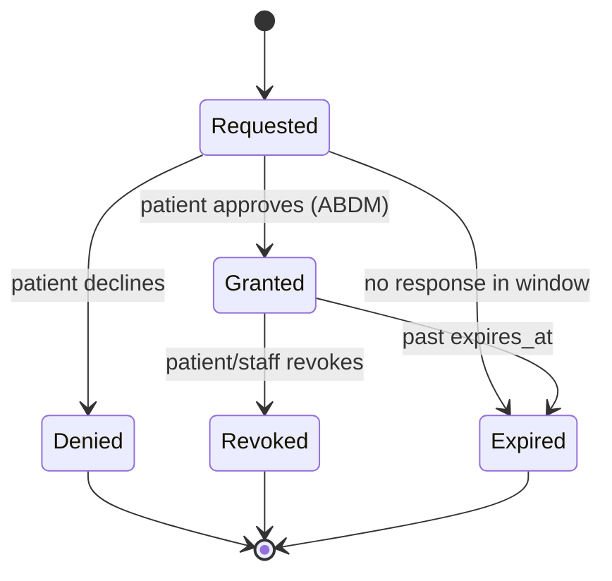
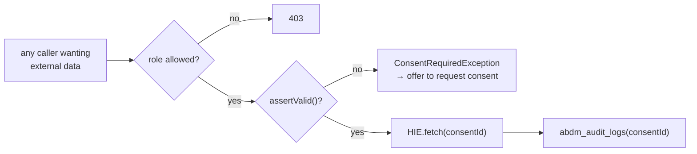
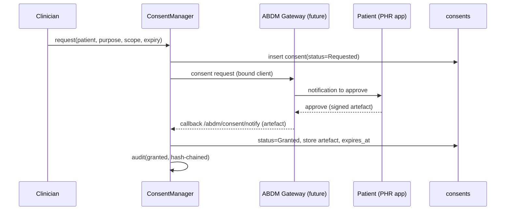

# 05 · Consent Engine
### The gate that governs all external health-information access

**Status:** DESIGN ONLY.
**Principle (from doc 00):** No external record is ever read, written, shown, or seen by the AI without a valid, unexpired consent artefact. Consent is enforced in code, logged immutably, and revocable.

---

## 1. Why consent is a first-class engine

In ABDM, the patient owns their data. A facility may only access another facility's records (HIU role) or share its own (HIP role) under a **consent artefact** — a signed, scoped, time-bound permission. Consent is not a checkbox; it is a lifecycle with legal weight. So it gets its own engine, its own tables, and a hard enforcement seam every data path must cross.

---

## 2. Consent state machine



| State | Meaning | External access allowed? |
|---|---|---|
| Requested | consent asked, awaiting patient | ❌ |
| Granted | active, within window & scope | ✅ (within scope only) |
| Denied | patient declined | ❌ |
| Revoked | withdrawn after grant | ❌ (and stop any sync) |
| Expired | past `expires_at` | ❌ |

---

## 3. Anatomy of a consent (what we store)

From `consents` + `consent_artefacts` (doc 03):

- **Purpose** — why (care management, referral, second opinion, self-request…). ABDM defines a purpose code set.
- **Requester** — who asked (this facility / a clinician).
- **Provider** — whose records (the HIP holding them).
- **Scope** — which HI-types (OPConsultation, Prescription, DiagnosticReport…) and which date range.
- **Window** — `granted_at` → `expires_at` (+ optional recurring access).
- **ABDM linkage** — `abdm_consent_id`, artefact id(s).
- **Audit** — every transition in `consent_audit` (hash-chained).

---

## 4. The enforcement seam — one function, called everywhere

```php
// app/Abdm/Consent/ConsentManager.php  (illustrative)
ConsentManager::assertValid(int $patientId, string $purpose, ?string $hiType = null): Consent
// throws ConsentRequiredException if none valid → callers must catch & handle
```

**Every** path that touches external data calls this first:
- AI tools (`ExternalHistoryTool`) — doc 02 §5.
- HIE fetch (`HealthInformationExchange::fetch`).
- Any UI panel showing linked external records.
- Any report including external data.

There is **no other way** to obtain external data — the HIE client is private to the layer and only reachable past the gate. Defense in depth: RBAC (can this *role* request external data) **AND** consent (is there a valid artefact).



---

## 5. Consent request flow (HIU — we want someone's records)



This phase: the `request()` API, tables, state machine, and audit are built; `GW` resolves to `NullGatewayClient` (no real call) behind the `consent_required`/`abdm_enabled` flags.

---

## 6. Consent for sharing (HIP — someone wants our records)

When another facility requests our patient's records, the Gateway calls our **callback** (`/abdm/hip/...`). The engine: verifies the artefact, checks it's within scope/window, assembles only the permitted FHIR bundles (via doc 04), and shares — logging every disclosure. Out-of-scope or expired → refuse + log.

---

## 7. Revocation & expiry (must actively stop data flow)

- **Revoke** — staff or patient revokes → status=Revoked, **any queued sync for that consent is cancelled** (Sync Engine reads consent status before sending), external panels hide, AI tools deny. Audit logged.
- **Expiry** — a scheduled job (`abdm:expire-consents`) flips Granted→Expired past `expires_at`; same downstream effects. (Mirrors your existing `expireStale()` membership pattern.)

---

## 8. Consent history & patient transparency

- `consent_audit` gives a complete, tamper-evident timeline per patient — surfaced as a **Consent History panel** on the patient profile (doc 01 §27).
- Patients can see what was shared, with whom, when, and revoke — a core ABDM patient right.

---

## 9. Governance guardrails

- **Purpose-binding** — a consent for "care management" cannot be reused for marketing or research. Marketing is explicitly barred from ABDM data (doc 01 §20).
- **Minimum necessary** — assemblers share only the HI-types in scope, only the date range granted.
- **No silent access** — every external read writes an `abdm_audit_logs` row with the consent id; the AI additionally stamps `ai_action_logs.consent_id`.
- **Fail closed** — if consent state is unknown/unreachable, access is denied, never assumed.

> Next: `06-SYNC-ENGINE.md`.
