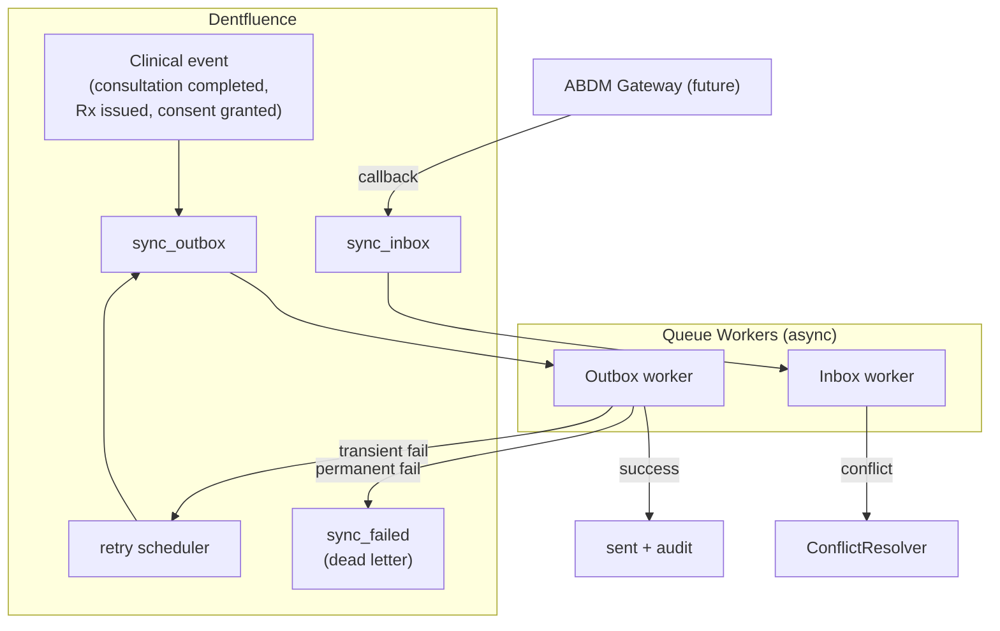

# 06 · Sync Engine
### Outgoing / incoming / retry / failed queues, conflict resolution, offline

**Status:** DESIGN ONLY.
**Principle:** ABDM exchange is asynchronous, unreliable-network-tolerant, and must never block clinical work or lose data. The app stays 100% usable with ABDM offline.

---

## 1. Queue topology



| Queue | Direction | Holds |
|---|---|---|
| `sync_outbox` | out → ABDM | care-context links, shared documents, consent responses |
| `sync_inbox` | in ← ABDM | fetched records, consent notifications, data requests |
| retry (via `next_attempt_at`) | out | transient failures, backoff |
| `sync_failed` | terminal | items past max attempts → manual review |

---

## 2. The outbox pattern (no lost events)

Clinical work and the "intent to sync" commit in the **same DB transaction**: when a consultation is marked complete, the service writes the consultation *and* a `sync_outbox` row atomically. A worker drains the outbox separately. If the network is down, the row simply waits — nothing is lost, the doctor isn't blocked.

```
DB txn: { save consultation; insert sync_outbox(entity=consultation, op=link_care_context) }  ← atomic
worker: pick queued → guard(flags+consent) → FHIR bundle → sign/encrypt → gateway → mark sent / retry / fail
```

This is the same append-only discipline your `stock_movements` and `wallet_transactions` already use — proven in your codebase.

---

## 3. Worker guards (checked at send time, not enqueue time)

Before any outbox item is sent, the worker re-checks:
1. `abdm_enabled` flag on (else skip/hold).
2. Consent still **Granted** (doc 05) — a revoke between enqueue and send must stop the send.
3. The `fhir_documents` row is `status=final` and validated (doc 04 §6) — never push drafts.
4. Facility config present (`facility_abdm_config.is_enabled`).

Guarding at send-time (not enqueue-time) is what makes revocation and flag-flips take effect immediately.

---

## 4. Retry & backoff

- Transient failures (timeout, 5xx, rate-limit) → exponential backoff with jitter via `next_attempt_at`; `attempts++`.
- Honor gateway `Retry-After`.
- Max attempts (configurable, default 6) → move to `sync_failed` with `last_error`; raise a staff notification (doc 01 §22) and a dashboard alert.
- `sync_failed` items are re-queueable by an admin after the cause is fixed — nothing is silently dropped.

---

## 5. Conflict resolution (incoming data vs. local)

When records arrive from HIE that overlap local data, the `ConflictResolver` decides:

| Scenario | Policy |
|---|---|
| External record we don't have | store as `patient_external_records` (read-only, never overwrites local) |
| External record duplicates ours | de-dupe by FHIR logical id + content hash; keep both, link as same care-context |
| External update to a record we authored | we are the source of truth for our own records; external is informational |
| Version skew | `sync_versions` vector clock per entity; newer wins for *that source*; cross-source stays side-by-side |

**Default stance:** external data is **additive and read-only** — it never mutates local clinical records. This avoids the entire class of "remote overwrote my note" disasters and matches the legal reality that each facility owns the records it authored.

---

## 6. Offline synchronization

- The whole app runs offline against local MySQL — ABDM is never on the critical path.
- Outbox accumulates while offline; drains automatically when connectivity returns.
- Inbox/callbacks that arrive during downtime are retried by the gateway (and we expose idempotent callback endpoints keyed by `abdm_txn_id` so replays are safe).
- **Idempotency** everywhere: every outbound op carries a client request id; every inbound callback is de-duped by `abdm_txn_id`. Processing the same message twice is a no-op.

---

## 7. Versioning & provenance

- Each entity tracked in `sync_versions` (entity, source, version, last_synced_at, content_hash).
- Re-sync only when `content_hash` changes (don't spam the gateway with unchanged records).
- Every successful exchange writes `abdm_audit_logs` (+ FHIR `Provenance`) — full traceability of what left/entered and under which consent.

---

## 8. Operational visibility

A **Sync Health** dashboard widget (doc 01 §26) shows: queued / sending / sent / failed counts, oldest queued item age, retry backlog, and last successful gateway contact. Workers expose metrics; `sync_failed` is the actionable list.

---

## 9. What's built this phase vs later

- **This phase (design):** table shapes, the outbox transaction discipline, guard contract, conflict policy, idempotency keys.
- **Phase 1 (code, later):** `sync_*` tables + a worker that drains the outbox to `NullGatewayClient` (proves the pipeline end-to-end with no real ABDM).
- **Phase 3+ (Sandbox/Prod):** bind the real gateway client; the engine code does not change.

> Next: `07-SECURITY-LAYER.md`.
