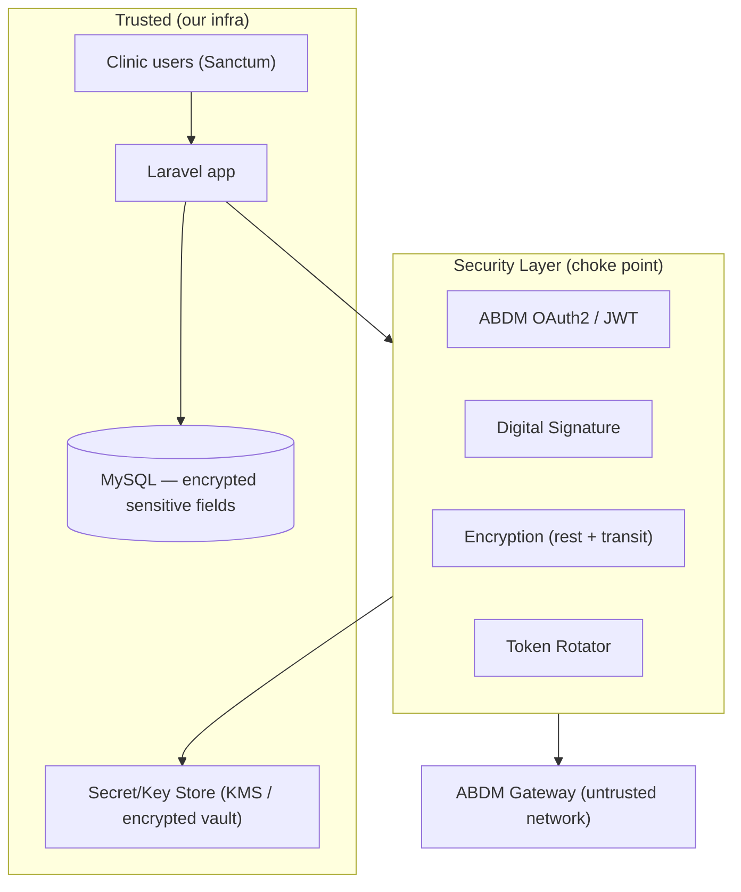

# 07 · Security Layer
### OAuth/JWT, encryption, secret storage, RBAC, token rotation, digital signatures

**Status:** DESIGN ONLY.
**Principle:** Health data is the most sensitive data we hold. The Security Layer is a dedicated part of the ABDM Layer; every external interaction passes through it. Fail closed, log everything, store no secret in code or DB.

---

## 1. Trust boundaries

Two **separate** auth worlds, never mixed:
- **User auth** — existing Laravel Sanctum (clinic staff). Unchanged.
- **ABDM auth** — OAuth2 client-credentials with the Gateway, short-lived JWTs, isolated in `AbdmAuthManager`.

---

## 2. Authentication & tokens

| Concern | Design |
|---|---|
| ABDM session | OAuth2 client-credentials → short-lived access token (JWT) from Gateway |
| Storage | `abdm_access_tokens` table holds **encrypted** token + expiry; never logged |
| Rotation | `TokenRotator` refreshes before expiry; on rotation, old token invalidated |
| User tokens | Sanctum unchanged; **never** reused for ABDM calls |
| Callback auth | inbound `/abdm/*` endpoints verify Gateway JWT signature + `abdm_txn_id` |

Token rotation interval and TTLs are settings (`security` group, doc 03 §6).

---

## 3. Encryption

**In transit:** all ABDM traffic over TLS 1.2+; mutual TLS where ABDM requires it; egress only from queue workers (single auditable path, doc 02 §9).

**At rest — selective field encryption** (Laravel encrypted casts / app-level AES-256-GCM):
- `patient_identifiers.value` for government IDs (Aadhaar ref, passport…) — only `value_last4` searchable.
- ABDM credentials are **references** in DB (`*_ref` columns), actual secrets in the key store.
- `digital_signature_ref` / `signing_key_ref` point to keys; keys never sit in MySQL.
- FHIR document bodies stored in object store; sensitive ones encrypted, DB holds `content_ref` + `content_hash`.

**ABDM payload encryption:** clinical bundles are encrypted per ABDM's HIP/HIU key-exchange spec before transport (the layer implements the ABDM crypto handshake later; the seam exists now).

---

## 4. Secret storage

- **No secret in `.env` committed, in code, or in DB.** DB stores only references.
- Backed by a key store: cloud KMS in production; an encrypted local vault / OS keychain for on-prem Laragon dev.
- `EncryptionService` and `SignatureService` resolve `*_ref` → key at runtime, cache in memory only, never persist.

---

## 5. Digital signatures

- Each finalized clinical document (`fhir_documents`) can be **signed** by the authoring practitioner (HPR-linked) — legally meaningful, ABDM-aligned.
- `SignatureService.sign(document, practitionerKeyRef)` → detached signature stored as `signature_ref`; `fhir_documents.signed=true`.
- Verification on the receiving side; signature status shown in UI.
- This is why `practitioner.digital_signature_ref` (doc 03 §4) exists — the *reference*, never the key.

---

## 6. RBAC (extends existing system)

Builds on your real `roles` + `modules` + `role_module_permissions` + `User::canAccess()`:
- New modules: `abdm`, `consent`, `health_exchange`, `fhir` (doc 01 §5).
- New high-privilege actions default to admin/doctor only: link ABHA, request consent, view external records, configure HFR/HIP, sign documents.
- `canAccessExternalRecords()` = RBAC permission **AND** valid consent (doc 05 §4) — both required.

---

## 7. Audit & non-repudiation

- `abdm_audit_logs` (doc 03 §12) is append-only and **hash-chained** (`row_hash = SHA-256(row + prev_hash)`) → tamper-evident.
- Every gateway call, consent decision, disclosure, and signature event is logged with actor, consent id, and `abdm_txn_id`.
- Maps to FHIR `AuditEvent` + `Provenance` for records we share.
- Logs never contain secrets, tokens, or full government IDs.

---

## 8. Threat model & mitigations (summary)

| Threat | Mitigation |
|---|---|
| Token theft | short TTL + rotation + encrypted-at-rest + memory-only key use |
| Replay of callbacks | idempotency by `abdm_txn_id`, signature verification |
| Unauthorized external access | RBAC ∧ consent, fail-closed gate |
| Data tampering | hash-chained audit, signed documents, content hashes |
| Secret leakage | references-only in DB/code, KMS-backed keys |
| Over-sharing | scope/window enforced by consent + minimum-necessary assemblers |
| Insider misuse | every access attributed + logged; high-priv actions gated |
| Malformed data exfil | validate against ABDM profiles before send (doc 04 §6) |

---

## 9. Compliance posture

Aligns the system toward ABDM's security requirements and India's DPDP Act / health-data guidelines: purpose limitation, consent, data minimization, audit, encryption, and the patient's right to access/revoke. Nothing here weakens existing behaviour — it's all additive and flag-gated.

> Next: `08-ROADMAP.md` — the phased build sequence.
