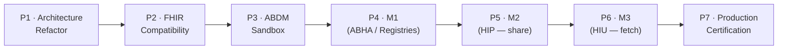
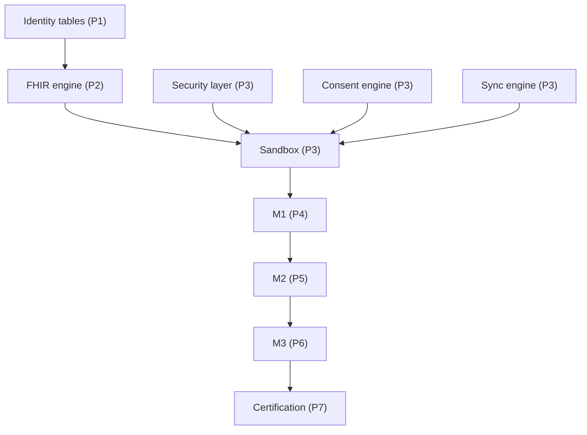

# 08 · Implementation Roadmap
### From today's app to ABDM Production certification — without breaking anything

**Status:** DESIGN ONLY — sequencing plan.
**Spine:** Architecture Refactor → FHIR Compatibility → ABDM Sandbox → M1 → M2 → M3 → Production Certification.
**Discipline:** every phase is additive, flag-gated, independently shippable, and reversible. You run all `artisan`/terminal commands yourself (per project rule); I provide the code + migrations.

---

## 1. Phase map

| Phase | Theme | Live ABDM calls? | User-visible change |
|---|---|:---:|---|
| P1 | Architecture & identity foundation | No | None (flags off) |
| P2 | FHIR generation + mapping | No | None (internal docs generated) |
| P3 | Sandbox wiring | Sandbox only | Test-mode ABHA card |
| P4 | M1 — ABHA + registries | Sandbox→Prod | ABHA/HPR/HFR linking live |
| P5 | M2 — HIP (share our records) | Prod | Records discoverable via consent |
| P6 | M3 — HIU (fetch others') | Prod | External history (consent-gated) |
| P7 | Certification & go-live | Prod | Full ABDM-native |

---

## 2. Phase 1 — Architecture Refactor *(the first safe coding chunk)*

**Goal:** lay the ABDM Layer + identity foundation. Nothing talks to ABDM. All flags off.

Deliverables:
- `app/Abdm/` skeleton + `AbdmManager` facade + `Contracts/` + `NullGatewayClient` bound by default.
- Identity tables: `patient_identifiers`, `practitioner_identifiers`, `practitioner_qualifications`; additive nullable columns on `patients`, `hr_staff_profiles`, `branches`; **create the `Branch` model**.
- Backfill internal identifiers from existing `patient_id` / `license_number` / `branches.code` (dual-write established).
- `facility_abdm_config`, `branch_settings`, feature flags seeded **off**.
- Queue worker introduced (`queue:work`) — proves async path with no ABDM.

Exit criteria: app behaves identically; new tables exist; identifier read/write works; full test suite green. **Reversible:** drop new tables, remove `app/Abdm/`.

> ⚠️ Truncation/size note for build time: Phase 1 is itself multi-part (migrations wave 1–2, then the layer skeleton, then backfill). We'll chunk it when we build, per your pre-flight rule.

---

## 3. Phase 2 — FHIR Compatibility

**Goal:** generate valid FHIR internally, prove conformance, still no ABDM.

Deliverables:
- FHIR Mapping Engine + mappers for the clinical core (Patient, Practitioner, Organization, Encounter, Condition, Observation, MedicationRequest, AllergyIntolerance).
- Bundle assemblers (OP Consultation, Prescription, Diagnostic, Discharge, Document, Wellness).
- `fhir_documents` + `terminology_maps` tables; seed maps for codes already used (ICD-10, FDI, common drugs/procedures).
- `patient_allergies` table + backfill from JSON.
- `FhirValidator` against R4 + ABDM profiles; unit tests against official example bundles.

Exit criteria: completing a consultation generates a valid, validated FHIR Bundle stored in `fhir_documents` (status=final) — verifiable offline. Zero exchange.

---

## 4. Phase 3 — ABDM Sandbox

**Goal:** wire the real (sandbox) gateway behind the flags; rehearse end-to-end safely.

Deliverables:
- `SandboxGatewayClient` implementing `Contracts/`; `AbdmAuthManager` (OAuth2), `TokenRotator`.
- Security Layer: encryption service, signature service, secret-store references, ABDM payload crypto handshake.
- Consent Engine live against sandbox; Sync Engine outbox→sandbox; idempotency + retry + `sync_failed`.
- Callback endpoints `/abdm/*` (signature-verified).
- Sandbox toggle in settings; sandbox test ABHA linking on the patient profile.

Exit criteria: a sandbox ABHA can be linked, a consent requested/granted, a bundle pushed and a record fetched — all in sandbox, all audited. Production flag still off.

---

## 5. Phases 4–6 — Milestones M1 → M2 → M3

ABDM certification is staged by milestone; we map each to a phase.

**Phase 4 — M1 (Health ID / ABHA + registries):**
- ABHA creation/verification/linking (`AbhaManager`); HPR linking for clinicians (`HprManager`); HFR for the facility (`HfrManager`).
- Patient/Doctor/Clinic profile ABHA/HPR/HFR cards go live.
- Bind `ProductionGatewayClient` for registry calls.

**Phase 5 — M2 (HIP — we share):**
- Care-context linking on consultation completion; HIP callbacks; share OP Consultation / Prescription / Diagnostic bundles under consent.
- Document signing live.

**Phase 6 — M3 (HIU — we fetch):**
- Consent request → fetch external records into `patient_external_records` (read-only, conflict-resolved).
- AI `ExternalHistoryTool` enabled (consent-gated); external-history UI panel.

Exit criteria per phase: ABDM milestone test-suite passes in sandbox, then the corresponding feature flag is enabled in production for a pilot branch.

---

## 6. Phase 7 — Production Certification & Go-Live

- Full ABDM certification run; security review / pen-test of the Security Layer; load-test sync workers.
- Hash-chained audit verification; DPDP-alignment review.
- Staged rollout: one pilot branch → monitor sync health + consent dashboards → expand.
- Runbooks for `sync_failed`, token rotation, key rotation, consent disputes.

---

## 7. Dependency graph (what blocks what)

The whole tree roots in **Phase 1 identity normalization** — which is why it's first and why it's additive/non-breaking.

---

## 8. Effort & risk (planning-level, not commitments)

| Phase | Relative effort | Primary risk | Mitigation |
|---|:---:|---|---|
| P1 | M | identifier backfill correctness | dual-write + verify scripts + tests |
| P2 | L | terminology coverage | data-driven `terminology_maps`, start with codes already used |
| P3 | L | ABDM crypto/auth handshake | sandbox-only, isolated layer, no prod data |
| P4 | M | registry edge cases | sandbox rehearsal first |
| P5 | M | over-sharing / consent scope | minimum-necessary assemblers, fail-closed gate |
| P6 | M | conflict handling | external = read-only, additive |
| P7 | M | certification gaps | single FHIR/consent surface = single thing to certify |

---

## 9. Guardrails that hold across all phases

1. **No destructive migrations, ever.** Additive tables + nullable columns only. You run migrations; no `migrate:fresh`/rollback without your say-so.
2. **Flags default off.** Production behaviour is unchanged until you flip a flag, per pilot branch.
3. **Reversible phases.** Each phase can be disabled by flag and its tables dropped.
4. **One choke point.** Only the ABDM Layer (only workers) talk to ABDM — one place to audit, secure, and certify.
5. **Pre-flight chunking.** Each phase's build will be size-estimated and split before coding, per your project rule.

---

## 10. Immediate next action (when you're ready to build)

Phase 1, Wave 1 — the identity tables + `Branch` model + `app/Abdm/` skeleton with `NullGatewayClient`. It's fully additive, touches no existing behaviour, and unlocks everything else. I'll size and split it, you approve, then I write the migrations + models for you to run.

> End of document set. See `00-ABDM-MASTER-INDEX.md` for the map.
