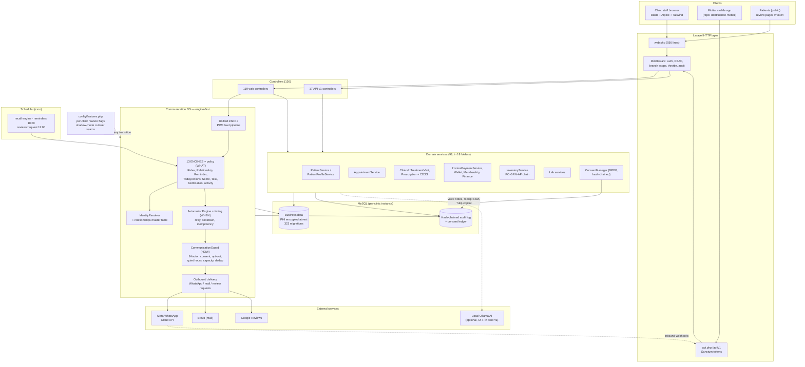

# Dentfluence OS — Engineer Handover Document

**Version:** v1.0 · **Last updated:** 2026-07-03 · **Audience:** engineers taking over development & operations.

> Read this first. It is the single source of truth for how the system is built *today*. Older docs (`/ARCHITECTURE.md`, `docs/target-architecture-engine-first.md`) describe history and target-state; where they conflict with this document, this document wins.

---

## 1. What this is

Dentfluence OS is a **dental clinic management platform** for the Indian market: patients, appointments, clinical records (consultations, treatment plans, prescriptions), billing/finance, inventory, lab work, staff operations (daily huddle, tasks), and a **Communication OS** (recalls, reminders, WhatsApp two-way, lead pipeline/PRM, reviews) — plus a Flutter mobile app consuming a first-party REST API.

**Business context you must know:**

- Product of a **solo founder (practicing dentist)**, built AI-pair-programmed over ~14 months. Domain logic is deep and real — it runs his own clinic daily.
- Target business model: **subscription SaaS** for Indian dental clinics; current deployment model is one Docker stack per clinic (see §7 Tenancy).
- **DPDP Act compliance deadline: 13 May 2027** (₹250 crore penalties). The consent module, PHI encryption, and audit chain exist because of this — treat them as load-bearing, never as optional extras.
- Roadmap phases A–H live in `docs/plan-build-timeline.md`; per-phase design docs in `docs/phase-*/`.

## 2. Stack & how to run

| Layer | Tech |
|---|---|
| Backend | PHP 8.x, **Laravel** (MVC + service layer), MySQL |
| Frontend | Blade templates + **Alpine.js** + Tailwind, built with Vite. No SPA framework. |
| Mobile | **Flutter** app (separate repo `dentfluence-mobile`), talks to `/api/v1` via Sanctum tokens |
| Async/scheduled | Laravel scheduler (cron) — recall engine, reminders, review requests |
| Messaging | WhatsApp Cloud API (Meta), Brevo (mail) |
| AI (optional, local) | Ollama (qwen2.5, llama3.1) + faster-whisper for voice notes, receipt scan, Tulip copilot — all behind flags, OFF in v1 production |
| Prod deployment | Docker Compose (app, mysql, nginx, queue, scheduler) + Caddy HTTPS on Hostinger VPS |

**Local dev (Windows/Laragon):**
```bash
composer install && npm install
cp .env.example .env && php artisan key:generate   # set DB creds
php artisan migrate --seed
npm run dev          # vite
php artisan serve    # or Laragon vhost
```

**Prod update procedure & versioning policy:** `docs/deploy/versioning-and-updates.md` (git tags `v1.0`, `v1.1`…; additive-only migrations; backup before every update).

**Useful first commands:**
```bash
php artisan security:selftest     # verifies Phase A security controls
php artisan app:crawl-routes      # auto-tests every page, HTML report
php artisan automation:parity recall|reminders|rules   # legacy-vs-engine shadow comparison
php artisan test                  # feature tests (49) — see §9
```

## 3. Scale snapshot (2026-07-03)

| Metric | Count |
|---|---|
| Controllers | 136 (119 web + 17 API v1) |
| Eloquent models | 211 (7 sub-namespaces: Finance, Inventory, Prescription…) |
| Services | 98 across 18 domain folders, incl. **13 engines** |
| Migrations | 323 (clean, versioned, additive) |
| Blade views | 420 (incl. 52 reusable components) |
| Routes | `web.php` 936 lines + `api.php` 360 lines |
| Tests | 49 Feature + 24 Dusk (browser) + 2 Unit |

## 4. Domain map

Functional domains and their primary code locations:

| Domain | Controllers | Services | Notes |
|---|---|---|---|
| Patients | `PatientController` | `Services/PatientService`, `PatientProfileService` | PHI-encrypted fields; 12-tab profile view |
| Appointments | `AppointmentController` | `Services/AppointmentService` | shared by web + API |
| Clinical (consultations, treatment plans/visits, Rx) | `ConsultationController`, `TreatmentPlanController`, `TreatmentVisitController`, `Prescription/*` | `Services/TreatmentVisitService`, `Prescription/*` | 4 consultation workflows (New / Same-Issue / Minor / Emergency); CDSS checks on Rx |
| Billing & Finance | `BillingController`, `Finance/*` | `Services/InvoicePaymentService`, `Finance/*` | invoices, EMI, wallets, memberships, expenses, P&L |
| Inventory & Procurement | `InventoryController` | `Services/InventoryService` | PO → GRN → vendor invoice → AP chain |
| Lab | `LabController`, `LabVendorController` | `Services/Lab/*` | case lifecycle + vendor mgmt |
| Communication OS | `Communication/*` (Timeline, Prm, Opportunity, B2B, Kpi, Huddle, Task) | `Services/Relationship/*`, `Services/Automation/*`, `Services/Communication/*`, `Services/Prm/*` | the modern core — see §5 |
| WhatsApp | `Communication/*` | `Services/Whatsapp/*` (Cloud API, inbound/outbound) | DPDP-gated, audited |
| Reviews | `Communication/ReviewsController` | `ReviewService` | public token pages `/r/{token}` |
| DPDP Consent | consent controllers | `ConsentManager` (hash-chained) | compliance-critical |
| Daily Huddle & Tasks | `app/Modules/Huddle/*` | module-local services | one of 2 active `app/Modules` |
| Settings / RBAC | `Settings/*` | — | roles, permissions, feature flags UI |
| API v1 (mobile) | `Api/V1/*` (17) | reuses domain services | Sanctum auth, response envelope, audited |
| AI (Tulip, voice, scan) | assistant controllers | `Services/Assistant/*` | local-only, flag-gated, OFF in prod v1 |

## 5. The engine-first architecture (the part to understand before touching anything)

The Communication OS was rebuilt in 2026 on an **engine-first** pattern with strict layering:

```
ENGINES decide WHAT should happen        (policy — pure, testable)
AUTOMATION decides WHEN it happens       (timing, retry, cooldown, idempotency)
COMMUNICATION decides HOW it's delivered (guard checks, channel, templates)
```

**The 13 engines** (in `app/Services/Relationship/`, `app/Services/Automation/`):
`RelationshipEngine` (links leads/patients to master relationship records), `IdentityResolver` (phone/email dedup), `RulesEngine` + `FollowUpRuleEngine` (automation rules), `TodayActionsEngine` (daily work projection), `ActivityEngine` (single event ledger), `RelationshipScoreEngine`, `NotificationEngine`, `ReminderEngine`, `AppointmentReminderEngine`, `TaskEngine`, `AutomationEngine` (Phase 2 timing primitives), plus runners (`RecallAutomationRunner`, `ReminderAutomationRunner`).

**Outbound message safety:** every automated message passes `CommunicationGuard` — an 8-factor check (consent, opt-out, capacity, quiet hours, dedup, …). Suppressions are logged. Do not bypass it.

**Feature flags (`config/features.php`)** gate every architectural transition. Resolution order: per-clinic override → global override → config default → `false`. Key flags:

| Flag | Meaning | State (2026-07-03) |
|---|---|---|
| `activity.single_ledger_reads` | timeline reads from Activity ledger | **ON** (cutover done) |
| `automation.engine` | recalls/reminders run through AutomationEngine | **ON** (parity-verified: 3,830 records, 0 divergence) |
| `rules.single_engine` | retire legacy FollowUpRulesService | **OFF** — seam built, flip pending |
| `identity.link_patient` | auto-link identities | ON |
| `guard.*` | CommunicationGuard strictness | ON |
| `workflow.engine`, `today.projection`, `integration.*` | Phase 3+ scaffolding | OFF, few/no callers yet |

**The cutover discipline (please keep it):** new engine runs in *shadow mode* alongside legacy → `automation:parity` command compares outputs on real data → flag flips only at 0 divergence → legacy is deleted only after a soak period. `tests/Feature/Automation/RecallShadowParityTest` and `tests/Characterization/*` show the pattern.

## 6. API layer (mobile contract)

- `routes/api.php` → `Api/V1/*` (17 controllers). Sanctum bearer tokens, uniform JSON envelope, per-request audit logging, RBAC middleware, pagination.
- API controllers **reuse the same domain services as web** (PatientService, AppointmentService, InvoicePaymentService, MembershipBenefitService…). Exceptions where logic was duplicated instead: inventory and prescriptions (see debt register §8).
- Consumer: the Flutter app (repo `dentfluence-mobile`). Server URL is user-configurable in-app; no hardcoded endpoints.
- Versioning: path-versioned (`/api/v1`). Breaking changes ⇒ `/api/v2`, never mutate v1 responses.

## 7. Data layer & tenancy

- **MySQL**, 323 additive migrations. Never `migrate:fresh`/rollback in production (see deploy doc).
- **PHI encryption at rest:** custom `Encrypted` / `EncryptedArray` casts on Patient, Consultation, PatientIdentifier, finance/HR models, WhatsApp threads/messages.
- **Tamper-evident audit:** hash-chained audit logs (`audit:verify` command), DPDP consent ledger is also hash-chained.
- **Branch scoping:** `BelongsToBranch` trait + `BranchScope` global scope (multi-branch clinics). Currently dormant-safe (admins bypass); designed for per-role logins.
- **Identity model:** polymorphic `patient_identifiers` (ABDM-ready), master `relationships` table backfilled over 3,814 real records.

**Tenancy decision (deliberate, not an oversight):** the platform ships as **one stack per clinic** (Docker Compose per customer: app + own MySQL). Rationale: hard data isolation (DPDP), zero noisy-neighbor risk, simple ops for the first ~50–100 customers. True shared-schema multi-tenancy was evaluated and deferred; nothing in the schema blocks it later (clinic-level config and flags already exist), but migrating to it is a declared **v2.0-scale project**, not a refactor to attempt casually.

## 8. Known technical debt — the honest register

This debt is **known, bounded, and has a retirement plan**. Nothing here is hidden.

| # | Debt | Where | Why it exists | Retirement plan |
|---|---|---|---|---|
| 1 | God-controllers | `InventoryController` (2,164 LOC), `BillingController` (1,667), `Finance/FinanceController` (1,281) | features accreted faster than refactors | split by sub-domain into services + thin controllers; do opportunistically when touching those areas |
| 2 | God-views | `patients/show.blade.php` (3,552 LOC), `settings/index.blade.php` (2,879) | 12-tab profile grew organically; Alpine scope structure is **fragile — read fully before editing** | extract per-tab Blade components; never big-bang rewrite |
| 3 | Legacy + new engines coexist | `FollowUpRulesService` (legacy) vs `RulesEngine`; old PRM remnants | deliberate shadow-mode strategy (§5) | flip `rules.single_engine`, soak, then delete legacy classes |
| 4 | Web/API logic duplication | inventory & prescription API controllers re-implement web logic | mobile parity was built at speed | extract shared read/report services; adapters stay thin |
| 5 | Low unit-test coverage | 2 unit tests vs 98 services (~5-10% coverage overall) | solo-builder velocity; feature+Dusk+parity tests carried the risk instead | **top priority for the incoming team**: unit tests for the 13 engines first, then billing money-paths |
| 6 | Half-adopted `app/Modules/` | only Huddle + PracticeProtocols are modules; 4 empty module dirs | experiment that wasn't rolled out | pick one convention: either migrate comm domains into Modules, or collapse Modules back into Services — don't leave both |
| 7 | Root `Documents/`, `under_review/`, `.archive/` folders | business files & parked artifacts | founder works in-repo; gitignored, never pushed | ignore them; they are not code |
| 8 | `DB::raw()` subqueries | ~15 files (Huddle boards, KPI, reports) | performance shortcuts | verify parameterization when touching; move to query-builder expressions |

**Anti-debt evidence to weigh against the list:** parity-verified cutovers on real data, hash-chained audit, feature-flag seams, additive-only migrations, `security:selftest`, route crawler. The codebase is ~60% modernized engine-first, ~40% earlier-era Laravel — and the boundary between the two is flagged, not smeared.

## 9. Testing

- `php artisan test` — 49 Feature tests (automation parity, characterization/spec-by-example for rules, security foundation, clinic journeys).
- 24 Laravel Dusk browser tests (daily workflows: login, treatment plan, billing).
- `php artisan automation:parity …` — production-data shadow comparison (the strongest safety net in the repo).
- Gap: unit-level isolation. Start with `AutomationEngine`, `RulesEngine`, `InvoicePaymentService`.

## 10. Deployment & operations

- Prod: Hostinger KVM VPS, Docker Compose (5 containers) + Caddy auto-HTTPS, live at `srv1791841.hstgr.cloud` (public domain intentionally not yet pointed).
- Release = git tag (`v1.0` now; `v1.1`… updates; `v2.0` majors). Full zero-data-loss procedure: `docs/deploy/versioning-and-updates.md`. Backups: `backup.sh` (DB dump + storage) before every update.
- MySQL + `storage/` live in Docker volumes — container rebuilds never touch data.
- Secrets: `.env` only (gitignored); `.env.production` template exists but is never committed.

## 11. Where to read next

| Topic | Document |
|---|---|
| Full system diagram | `docs/architecture/system-map.mermaid` (also embedded below, §12) |
| Target architecture & rationale | `docs/target-architecture-engine-first.md` |
| 18-month build roadmap (Phases A–H) | `docs/plan-build-timeline.md` |
| Phase 2 automation go-live | `docs/phase-2/go-live-runbook.md` |
| Security controls (Phase A) | `docs/security/` + `php artisan security:selftest` |
| Competitive positioning | `docs/competitive/eka-care-vs-dentfluence.md` |
| Dev history / changelog | `docs/DEVLOG.md` |

## 12. System map

(Same diagram as `docs/architecture/system-map.mermaid` — paste into mermaid.live or any Markdown viewer with Mermaid support.)



---
*Prepared 2026-07-03 during v1.0 handover preparation. Keep this document updated at every tagged release.*
