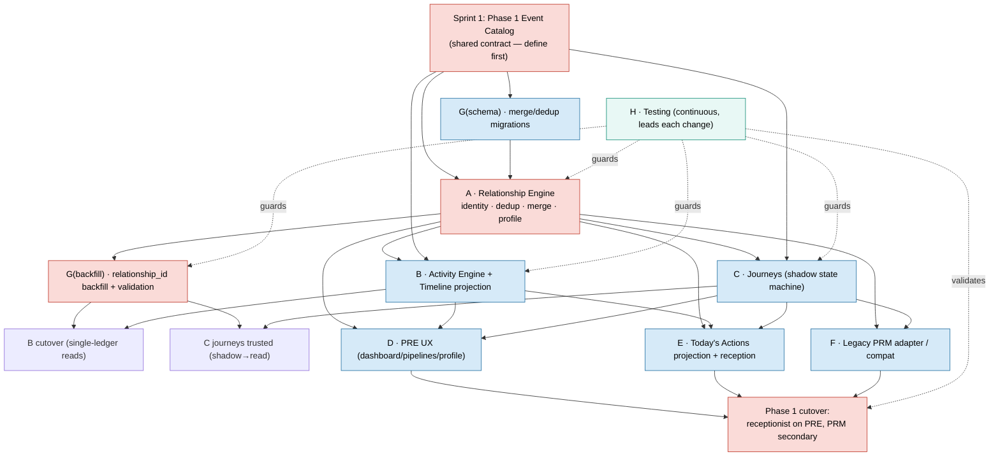

# Phase 1 — Relationship Platform (PRE): Execution Plan

**Role:** Engineering Manager (planning only)
**Date:** 2026-07-02
**Nature:** Execution plan only. **No code. No file changes.** Architecture is frozen — this schedules *already-decided* work; it introduces no engine and moves no responsibility.

---

## 0. Scope reconciliation (read first)

Your Phase 1 goal — *"the receptionist works only with PRE; legacy PRM survives internally but is no longer primary"* — spans the **read/experience** side of what the frozen Blueprint labelled Phases 1–3:

| Blueprint phase | Read-side work pulled into this "Phase 1 (PRE)" | Deferred to later (NOT in Phase 1) |
|---|---|---|
| P1 Relationship Foundation | Identity, `linkPatient`, backfill, journeys-in-shadow, single Activity ledger | — |
| P2 Automation | — | Rules/Automation/reminders (write-side) → **later** |
| P3 Work surfaces | Today's Actions **presentation**, reception dashboard, Task read views | Task human/system split internals → **later** |

This is a **resequencing, not a redesign**: every item below already exists in the Baseline. Phase 1 delivers the PRE *experience* (identity + timeline + journeys + Today's Actions + UX + compatibility) while **automation, the Communication Engine, and Workflow remain untouched** for their own phases. Journeys become authoritative **in shadow** (leads.stage still written) — full pipeline-SSOT cutover stays in the Blueprint's Phase 4.

**Phase 1 exit criterion:** a receptionist can run their entire day on PRE (dashboard, pipelines, profile, Today's Actions), PRM still functions but is secondary, and no data or workflow is lost.

---

## 1. What already exists (so we build the gap, not the whole)

Grounding the plan in the real code:

- **Relationship Engine** (`app/Services/Relationship/RelationshipEngine.php`) — `findOrCreate`, `linkLead` (wired via `LeadIngestService`), `linkPatient` (**exists but unwired**), `getProfile`. Models: `Relationship`, `RelationshipJourney`, `Activity`.
- **Activity Engine** (`ActivityEngine.php`) + `activities` table — live. Legacy `lead_activities`, `comm_activity_logs` still written.
- **Journeys** (`RelationshipJourney.php`) — model + transitions; `PrmController::moveStage` already dual-writes a journey.
- **Profile/Today/Analytics** controllers (`app/Http/Controllers/Relationship/*`) — `ProfileController` merges timeline at read time; `TodayActionsEngine` live-reads ~12 domains.
- **Schema** — `relationship_id` columns already added to `leads`, `patients`, `treatment_opportunities`, `tasks` (mostly unbackfilled).
- **Phase 0 foundations** — `Feature` flags, `DomainEventBus`, `DecisionLogRecorder`, `EngineLog`, `SystemStatus`, hardened Guard. Phase 1 **uses** these (flags gate every cutover; the bus carries the first real domain events).

So Phase 1 is mostly **wiring, backfill, projections, UX, and compatibility** — not greenfield.

---

## 2. Workstreams A–H

> Per workstream: **Objective · Key files · Depends on · Risk · Complexity · Parallel? · Must wait? · Est. effort** (solo-developer dev-days; gated, not time-boxed).

### Workstream A — Relationship Engine (identity, dedup, merge, profile)
- **Objective:** One reliable Master Relationship per person. Wire `linkPatient`; add identity resolution (fuzzy match), a dedup review path, and merge history; harden `getProfile`.
- **Key files:** `app/Services/Relationship/RelationshipEngine.php`; new `IdentityResolver`, `MergeService` (same namespace); `app/Models/Relationship.php`; new `RelationshipMerge` model; `LeadObserver`, `LeadIngestService` (already call `linkLead`); patient-create path (to call `linkPatient`, flagged).
- **Depends on:** Phase 1 event catalog (Sprint 1); G's merge/dedup schema.
- **Risk:** **High** — mis-merge = clinical-safety incident. Mitigation: conservative matching, human review queue, reversible merges.
- **Complexity:** High.
- **Parallel?** Core of the critical path; its *scaffolding* parallels B/C, but its outputs gate G/D/E.
- **Must wait?** Only for the event catalog + G's additive schema.
- **Est. effort:** 6–9 days.

### Workstream B — Activity Engine (unified ledger + timeline projection)
- **Objective:** `activities` becomes the sole write target; producers emit domain events; build the Timeline projection; retire read-time merge behind a flag.
- **Key files:** `ActivityEngine.php`; `app/Models/Activity.php`; `ProfileController::buildTimeline` (to retire); new `TimelineProjection` service + read model; legacy `LeadActivity`/`CommActivityLog` (→ mirror).
- **Depends on:** A (relationship id to attach facts); event catalog.
- **Risk:** Medium — timeline gaps if a producer isn't migrated. Mitigation: dual-write + parity checks before flag flip (`activity.single_ledger_reads`).
- **Complexity:** Medium.
- **Parallel?** Yes — separate files from A; can scaffold in parallel, cut over after A + backfill.
- **Must wait?** Read cutover waits on A + G backfill.
- **Est. effort:** 5–7 days.

### Workstream C — Relationship Journeys (lead/opportunity/recall, state machine)
- **Objective:** Journey state machines authoritative **in shadow**; dual-write with `leads.stage` / `treatment_opportunities.status`; log divergence.
- **Key files:** `app/Models/RelationshipJourney.php`; new `JourneyService` + per-type state maps; `PrmController::moveStage` (already syncs — formalize); `TreatmentOpportunity` model.
- **Depends on:** A (relationships exist); event catalog.
- **Risk:** Medium/High — pipeline state divergence, UI-facing. Mitigation: shadow-only in Phase 1; divergence report must be ~0 before any read trusts journeys.
- **Complexity:** High.
- **Parallel?** Yes with B; shadow write parallels A once relationships resolve.
- **Must wait?** Reading journeys as truth waits on G backfill + divergence sign-off.
- **Est. effort:** 6–8 days.

### Workstream D — PRE User Experience (dashboard, pipelines, profile UI)
- **Objective:** The receptionist-facing PRE: relationship dashboard, lead/opportunity/recall pipeline views, relationship profile UI — reading A/B/C, behind a flag, alongside PRM.
- **Key files:** `app/Http/Controllers/Relationship/ProfileController.php`; new PRE controllers/views under `resources/views/relationship/*`; `routes/relationship.php` (additive).
- **Depends on:** A (profile), B (timeline), C (journeys/pipeline).
- **Risk:** Medium — UX regressions vs PRM. Mitigation: equal-or-simpler gate; flag `identity.reads_relationship`; PRM stays reachable.
- **Complexity:** Medium/High (UI volume).
- **Parallel?** Partially — build against A/B/C contracts as they land; finalize last.
- **Must wait?** Full finish waits on A/B/C.
- **Est. effort:** 7–10 days.

### Workstream E — Today's Actions / Reception dashboard / Daily Huddle
- **Objective:** Replace the god-reader with a Today's Actions **projection** fed by events; reception dashboard, Today's Calls, Today's Work; Huddle reads shared views.
- **Key files:** `app/Services/Relationship/TodayActionsEngine.php`; `TodayController.php`; new `TodayActionsProjection` + read model; `app/Services/Huddle/*` (read wiring); reception views.
- **Depends on:** A, B, C (events feeding the projection).
- **Risk:** Medium — projection lag hiding actions; parity vs current list. Mitigation: shadow + parity before `today.projection` flip.
- **Complexity:** Medium.
- **Parallel?** Projection scaffold parallels C; cutover last.
- **Must wait?** Cutover waits on B/C events flowing.
- **Est. effort:** 5–7 days.

### Workstream F — Backward compatibility (legacy PRM adapter/routes/APIs)
- **Objective:** PRM keeps working while PRE becomes primary. Adapter so PRM writes flow into journeys/activities; legacy routes redirect; **`/api/v1` frozen**; public links preserved.
- **Key files:** `app/Http/Controllers/Communication/PrmController.php`; `routes/prm.php`; `app/Services/Prm/*`; `Api/V1/*` (read-only, frozen); redirect wiring.
- **Depends on:** A + C (targets to adapt into).
- **Risk:** Medium — a broken legacy path loses a live workflow. Mitigation: dual-run, keep PRM warm, contract tests on `/api/v1`.
- **Complexity:** Medium.
- **Parallel?** Yes — F is cross-cutting and mostly touches PRM-only files (low conflict with D's new PRE files).
- **Must wait?** Redirect/flip to secondary waits until PRE UX (D/E) is usable.
- **Est. effort:** 4–6 days.

### Workstream G — Database (backfill, relationship IDs, validation)
- **Objective:** Additive schema for merge/dedup; idempotent backfill of `relationship_id` across leads + patients; data validation + dedup review queue.
- **Key files:** `database/migrations/*` (new: `relationship_merges`, `dedup_candidates`); new backfill commands in `app/Console/Commands/*`; validation reports.
- **Depends on:** A's `IdentityResolver` (backfill uses it). Schema migrations can precede A logic.
- **Risk:** **High** — wrong merge corrupts identity. Mitigation: dry-run first, review queue for ambiguous, checksum/row-count validation, reversible.
- **Complexity:** Medium/High.
- **Parallel?** Migrations parallel with A; **backfill run** waits on A.
- **Must wait?** Backfill execution waits on A dedup logic.
- **Est. effort:** 5–7 days.

### Workstream H — Testing (regression, identity, timeline, journey)
- **Objective:** Characterization safety net **before** each refactor, then identity/timeline/journey/regression suites; acceptance dogfood at Tulip Dental.
- **Key files:** `tests/Feature/Characterization/*` (extend Phase 0), `tests/Feature/*` new suites, `/api/v1` contract tests.
- **Depends on:** Nothing to *start* (characterization is first); feature tests track their workstream.
- **Risk:** Low (but its *absence* is high-risk). Mitigation: characterization precedes every change.
- **Complexity:** Medium.
- **Parallel?** Yes — continuous, alongside all.
- **Must wait?** Never; it leads.
- **Est. effort:** continuous (~4–6 days total spread).

---

## 3. Dependency graph

**Critical path:** Event Catalog → **A (identity/dedup/merge)** → **G backfill** → **C journeys / B ledger** → **E Today's Actions + D UX** → **Phase 1 cutover**.

---

## 4. Implementation order (4 sprints)

> Each sprint lists **Parallel tasks · Sequential tasks · Critical path**. Everything ships behind Phase 0 flags (default legacy) with dual-run before any flip.

### Sprint 1 — Contracts & Foundations (unblock everything)
- **Sequential (must be first):** define the **Phase 1 Domain-Event Catalog** — `PatientRegistered`, `LeadCaptured`, `RelationshipLinked`, `RelationshipMerged`, `JourneyTransitioned`, `ActivityRecorded` (contracts only, over the Phase 0 bus). *This single shared task is what makes A–G parallelizable without conflict.*
- **Parallel:**
  - **A:** `IdentityResolver` (matching rules) + wire `linkPatient` behind `identity.link_patient` (shadow).
  - **G(schema):** additive migrations — `relationship_merges`, `dedup_candidates`. No backfill yet.
  - **H:** characterization tests for current lead flow, patient creation, timeline read (safety net **before** any change).
  - **F(prep):** inventory legacy PRM surface + design adapter (no behavior change).
- **Critical path:** Event Catalog → A(IdentityResolver).
- **Merge-conflict note:** only the event-catalog + migrations are shared; everything else is disjoint.

### Sprint 2 — Identity Whole & the Ledger
- **Sequential:** **A** completes dedup review queue + `MergeService` + reversible merge history → **G(backfill)** runs (dry-run → validate → apply) using A's resolver.
- **Parallel:**
  - **B:** producers emit `ActivityRecorded`; begin dual-writing all history into `activities`; Timeline projection scaffold.
  - **H:** identity tests, relationship tests, backfill validation harness.
- **Critical path:** A dedup/merge → G backfill.
- **Gate:** backfill validated (row-count + checksum + review-queue signed off) before Sprint 3 trusts identity.

### Sprint 3 — Journeys & Timeline (shadow → trusted-read)
- **Parallel:**
  - **C:** Journey state machines dual-written in shadow; divergence report vs stage/status.
  - **B:** Timeline projection cutover behind `activity.single_ledger_reads` (after parity).
  - **D:** PRE dashboard + pipeline + profile UI built against A/B/C (behind `identity.reads_relationship`, alongside PRM).
  - **F:** PRM adapter live — PRM writes route into journeys/activities; legacy routes/APIs stay green (contract tests).
  - **H:** journey tests, timeline tests, `/api/v1` contract tests.
- **Sequential within C:** shadow-write → divergence ≈ 0 → PRE reads may trust journeys.
- **Critical path:** C shadow journeys (needs G backfill) → D/E can consume.

### Sprint 4 — Reception on PRE & Cutover
- **Parallel:**
  - **E:** Today's Actions projection behind `today.projection`; reception dashboard, Today's Calls/Work, Huddle read wiring.
  - **D:** PRE profile + pipelines finalized; end-to-end receptionist flow.
  - **F:** flip PRM to **secondary** — receptionist defaults to PRE; PRM reachable via redirect, not primary.
  - **G:** final data validation.
- **Sequential (last):** parity + acceptance at **Tulip Dental** → flip the reception-facing flags per clinic → **Phase 1 cutover**.
- **Critical path:** E projection + D UX → cutover.
- **Exit:** receptionist runs the day on PRE; PRM compat-only; zero lost data/workflow; `/api/v1` unchanged.

---

## 5. Optimization summary (the four goals)

**Maximum parallel development.** After Sprint 1's shared event catalog + schema, A/B/C/D/E/F run largely in parallel because each owns a **disjoint file zone**:

| Workstream | Primary file zone (owner) |
|---|---|
| A | `Services/Relationship/RelationshipEngine`, `IdentityResolver`, `MergeService`, `Models/Relationship*` |
| B | `Services/Relationship/ActivityEngine`, `TimelineProjection`, `Models/Activity` |
| C | `Models/RelationshipJourney`, `JourneyService` |
| D | `resources/views/relationship/*`, new PRE controllers |
| E | `Services/Relationship/TodayActionsEngine`, `TodayController`, `TodayActionsProjection` |
| F | `Controllers/Communication/PrmController`, `routes/prm.php`, `Services/Prm/*` |
| G | `database/migrations/*`, `Console/Commands/*` |
| H | `tests/*` |

**Minimum merge conflicts.** Only three shared hotspots, each with a rule:
1. **Event catalog** — *define-first in Sprint 1, then frozen* (additive-only).
2. **`RelationshipEngine.php`** — *single owner = Workstream A*; others depend on its interface, never edit it.
3. **Migrations** — *additive-only, one file per change, never edit an existing migration.*

**Minimum architecture risk.** No new engines, no moved responsibilities; journeys stay **shadow** in Phase 1 (full SSOT cutover deferred to Blueprint P4); every change behind a Phase 0 flag defaulting to legacy; characterization tests precede every refactor.

**Maximum backward compatibility.** `/api/v1` contracts frozen (Flutter app safe); PRM stays functional and reachable (adapter + redirects, never 404); public review/URL links preserved; expand-only DB (backfill additive, zero deletion); instant rollback by flipping any flag off.

---

## 6. Sequenced go-list (for approval, one workstream at a time)

1. **Sprint 1:** Event Catalog → A(IdentityResolver + linkPatient shadow) ‖ G(schema) ‖ H(characterization) ‖ F(prep).
2. **Sprint 2:** A(dedup/merge) → G(backfill+validate) ‖ B(ledger dual-write) ‖ H(identity).
3. **Sprint 3:** C(journeys shadow) ‖ B(timeline cutover) ‖ D(PRE UX) ‖ F(adapter) ‖ H(journey/timeline).
4. **Sprint 4:** E(Today's Actions projection) ‖ D(finalize) ‖ F(PRM→secondary) → Tulip Dental acceptance → **cutover**.

**Recommended first build after approval:** Sprint 1, starting with the **Phase 1 Domain-Event Catalog** (small, shared, unblocks all of A–G), then **Workstream A's `IdentityResolver` + `linkPatient` wiring** behind `identity.link_patient` in shadow.

---

*Plan only — no code, no files changed. On approval we implement one workstream at a time, in the sprint order above, each behind its flag with characterization tests first.*
